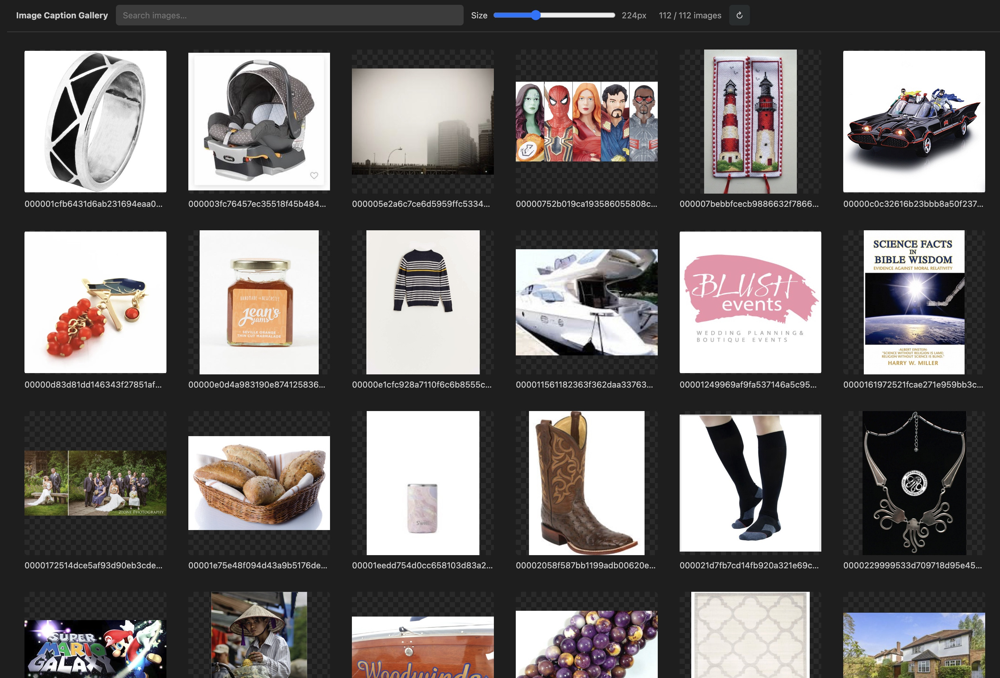
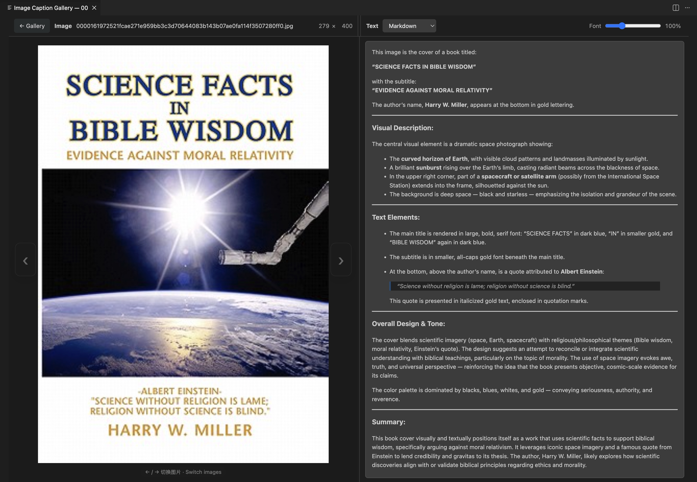
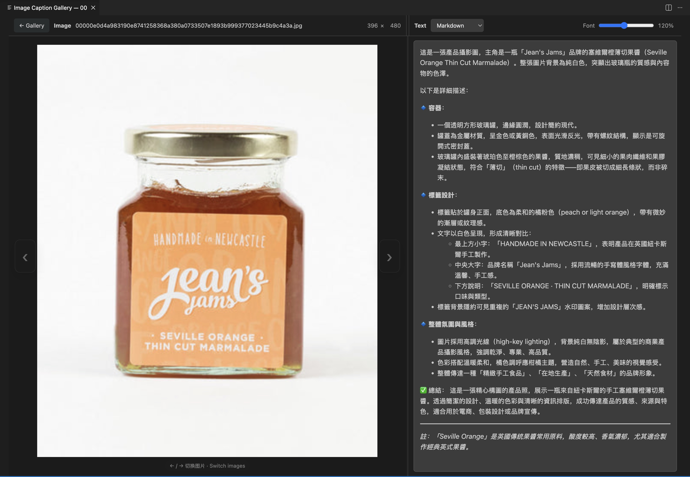

# Image Caption Gallery

[English](README.md) | [简体中文](README.zh-CN.md)

A fast, local-first VS Code extension for browsing image datasets and reading sidecar captions without leaving the editor.

Open a folder as an adjustable thumbnail gallery, select an image, and review its matching `.txt` caption beside it. Captions are read-only and can be rendered as Markdown, raw text, or formatted JSON.

## Preview

### Gallery overview

<p align="center">
  
</p>

### Image and Markdown caption

<p align="center">
  
</p>

### Multilingual captions

<p align="center">
  
</p>

## Features

- Open a folder or selected image from the Explorer context menu.
- Launch instantly with `Command+Option+G` (`⌘⌥G`) on macOS or `Ctrl+Alt+G` on Windows/Linux.
- Recursively discover `.jpg`, `.jpeg`, `.png`, `.webp`, `.gif`, `.bmp`, and `.avif` files.
- Resize gallery thumbnails continuously from 96 px to 480 px.
- Search images by filename or relative path.
- Read same-name `.txt` sidecar captions without modifying dataset files.
- Render captions as Markdown by default, with Raw text and formatted JSON modes.
- Drag the center divider to resize the Image and Text panes.
- Keep every image fully visible without cropping, even after resizing the window or divider.
- Zoom from 25% to 400% with a trackpad pinch or `Ctrl/Command + wheel`.
- Pan an enlarged image by dragging or two-finger scrolling, and double-click to restore the original fitted view.
- Show the original `width × height` resolution as right-aligned values in stable four-character fields.
- Scale caption text from 70% to 180%.
- Switch images with `Left` / `Right` or the translucent image-edge controls.
- Return to the gallery with `Escape` while preserving search and thumbnail state.
- Work with local folders and VS Code Remote SSH workspaces.

## Install

Install directly from the VS Code Marketplace:

```bash
code --install-extension xingfu-yi.image-caption-gallery --force
```

You can also download the latest `.vsix` from [GitHub Releases](https://github.com/Xingfu-Yi/vscode-image-caption-gallery/releases) and run **Extensions: Install from VSIX...** from the VS Code Command Palette.

When using Remote SSH, install the extension in the remote extension host. If you run the command in a remote terminal, copy the `.vsix` to the remote machine first and use its remote path.

## Usage

1. Open a folder that contains images and matching caption files.
2. Right-click an image or folder in Explorer and select **Image Caption Gallery**. You can also select an image and press the launch shortcut.
3. Adjust the thumbnail size or search the gallery.
4. Select an image to open the side-by-side Image and Text view.

### Shortcuts

| Action | macOS | Windows / Linux |
| --- | --- | --- |
| Open Image Caption Gallery | `Command+Option+G` (`⌘⌥G`) | `Ctrl+Alt+G` |
| Previous / next image | `Left` / `Right` | `Left` / `Right` |
| Zoom image | Trackpad pinch or `Command + wheel` | Touchpad pinch or `Ctrl + wheel` |
| Pan enlarged image | Drag or two-finger scroll | Drag or two-finger scroll |
| Reset image view | Double-click image | Double-click image |
| Return to gallery | `Escape` | `Escape` |

## Dataset layout

The caption file must use the same base name as the image:

```text
dataset/
├── image-001.jpg
├── image-001.txt
├── image-002.png
└── image-002.txt
```

## Compatibility

- Visual Studio Code 1.85.0 or newer.
- Local workspaces and VS Code Remote SSH.
- Platform-independent package with no native runtime dependencies.

## Privacy

Image Caption Gallery reads images and captions directly from the current workspace. It does not upload dataset files and does not include telemetry.

## Development

```bash
npm install
npm run compile
```

Open the repository in VS Code and press `F5` to launch an Extension Development Host.

## Roadmap

- Virtualized rendering for very large datasets.
- More configurable caption and metadata formats.
- Richer sorting and filtering.
- Image metadata and dataset-quality tools.

## Contributing

Issues and pull requests are welcome. Please keep changes focused and describe how you tested local and Remote SSH behavior.

## License

[MIT](LICENSE)
