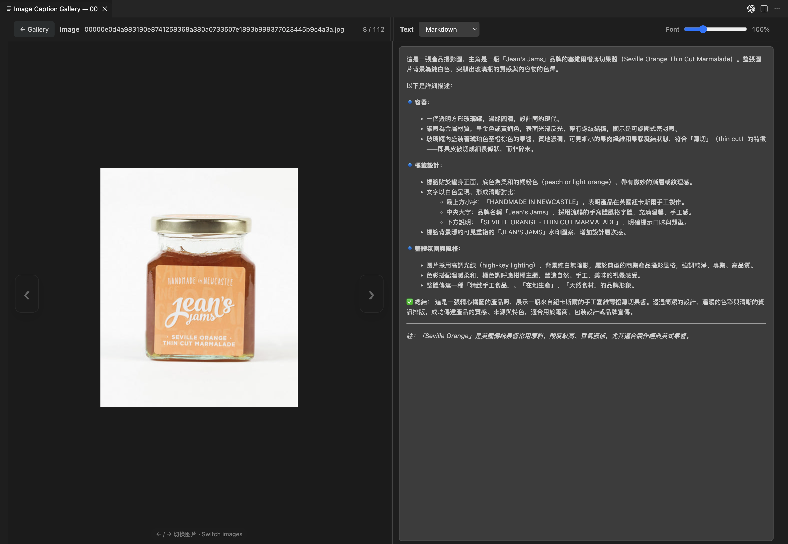
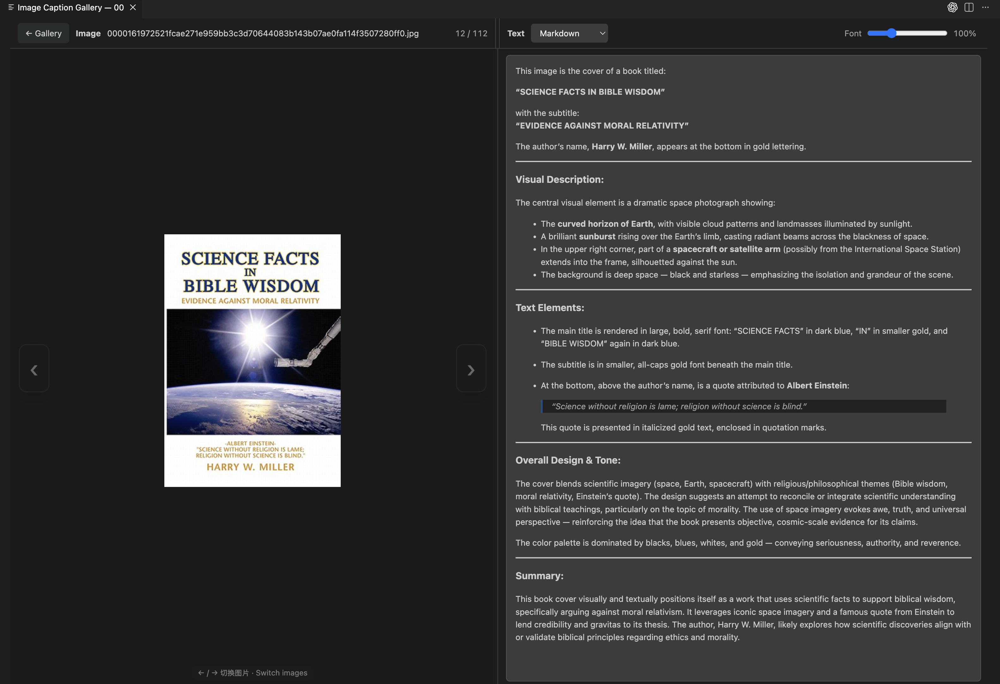

# Image Caption Gallery

[English](README.md) | [简体中文](README.zh-CN.md)

一个快速、本地优先的 VS Code 图片数据集浏览插件，让你无需离开编辑器就能查看图片及其配套 Caption。

你可以把一个目录打开为可调节缩略图大小的 Gallery，点击任意图片后，在左侧查看图片、右侧阅读同名 `.txt` 文本。Caption 采用只读模式，并支持 Markdown、原始文本和格式化 JSON 三种显示方式。

## 界面预览

### 图片与中文 Markdown Caption

<p align="center">
  
</p>

### 图片与英文 Markdown Caption

<p align="center">
  
</p>

## 主要功能

- 从 VS Code 资源管理器右键打开图片目录或当前选中的图片。
- macOS 使用 `Command+Option+G`（`⌘⌥G`），Windows/Linux 使用 `Ctrl+Alt+G` 快速启动。
- 递归发现 `.jpg`、`.jpeg`、`.png`、`.webp`、`.gif`、`.bmp` 和 `.avif` 图片。
- 将 Gallery 缩略图大小从 96 px 连续调整到 480 px。
- 按文件名或相对路径搜索图片。
- 读取与图片同名的 `.txt` Caption，不修改数据集中的任何文件。
- 默认使用 Markdown 渲染，也可切换为 Raw 原始文本或格式化 JSON。
- 拖动中间分隔线，自由调整 Image 与 Text 两栏宽度。
- 将 Caption 字体缩放到 70%–180%。
- 使用 `←` / `→` 键或图片两侧的半透明按钮切换图片。
- 使用 `Escape` 返回 Gallery，并保留搜索条件和缩略图状态。
- 支持本地工作区和 VS Code Remote SSH。

## 安装

从 [GitHub Releases](https://github.com/Xingfu-Yi/vscode-image-caption-gallery/releases) 下载最新的 `.vsix` 文件，然后运行：

```bash
code --install-extension image-caption-gallery-0.0.6.vsix --force
```

也可以在 VS Code 命令面板中运行 **Extensions: Install from VSIX...**。

使用 Remote SSH 时，需要把插件安装到远程扩展主机。如果在远程终端运行安装命令，请先把 `.vsix` 复制到服务器，并使用服务器上的文件路径。

## 使用方法

1. 在 VS Code 中打开包含图片和 Caption 的目录。
2. 在资源管理器中右键点击图片或目录，选择 **Image Caption Gallery**；也可以选中图片后直接按启动快捷键。
3. 在 Gallery 中调整缩略图大小或搜索图片。
4. 点击图片，进入左侧 Image、右侧 Text 的并排预览界面。

### 快捷键

| 操作 | macOS | Windows / Linux |
| --- | --- | --- |
| 打开 Image Caption Gallery | `Command+Option+G`（`⌘⌥G`） | `Ctrl+Alt+G` |
| 上一张 / 下一张图片 | `←` / `→` | `←` / `→` |
| 返回 Gallery | `Escape` | `Escape` |

## 数据集目录格式

Caption 文件需要与图片使用相同的主文件名：

```text
dataset/
├── image-001.jpg
├── image-001.txt
├── image-002.png
└── image-002.txt
```

## 兼容性

- Visual Studio Code 1.85.0 及以上版本。
- 支持本地工作区和 VS Code Remote SSH。
- 无原生运行时依赖，VSIX 安装包不区分操作系统平台。

## 隐私

Image Caption Gallery 只从当前工作区读取图片和 Caption，不会上传数据集文件，也不包含遥测功能。

## 本地开发

```bash
npm install
npm run compile
```

使用 VS Code 打开本仓库并按 `F5`，即可启动 Extension Development Host。

## 后续计划

- 为超大型数据集提供虚拟化渲染。
- 支持更多可配置的 Caption 和元数据格式。
- 提供更丰富的排序和筛选能力。
- 增加图片元数据和数据集质量检查工具。

## 参与贡献

欢迎提交 Issue 和 Pull Request。请尽量保持改动范围清晰，并说明在本地与 Remote SSH 环境中的测试方式。

## 开源协议

[MIT](LICENSE)
